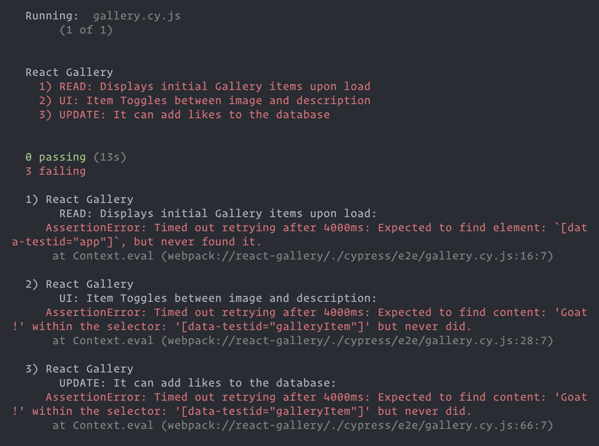

# React Gallery

Before you get started make sure to look through the code that has been provided.

## Get Set Up:

You'll need to:
* `npm install` to install the dependencies specified by `package.json`.
* Use Postico to create a new database named `react-gallery`.
* Run the SQL queries found in `database.sql` in order to:
  * Create the `gallery` table.
  * Seed the `gallery` table with one example gallery item.
* Run `npm run server` to start the Express server with `nodemon`.
* Run `npm run client` to start the React app.
* Run `npm test` to verify that the automated test suite runs. You should see something like this:
  * 

#### Add Your Own Seed Data:

Before you get started, add a few images to the `public/images` folder and modify the `INSERT` statement in the `database.sql` file to add your images to the `gallery` table. (You'll only need to provide `url`, `title`, and `description` values, because `likes` defaults to `0`.)

## Quick Note on Rendering Images:

To render images inside your React app, this totally works. Check out the example in `App.jsx`:

* ```jsx
    
  ```

* Because the `public/` folder is where our static assets live, all of your `` elements' `src=` attributes will look inside the `public/` folder for the filepath you provide.


## Base Mode:

#### Required Functionality:

For this project, you will create a gallery page to share pictures of things that are important to you.

Users should be able to:
* Click on a gallery item to toggle between seeing its image or description text.
* Click on a gallery item's "like" button to add a "like" to an image. 

#### Required Architecture:

To practice passing values as `props` in React, you must build your gallery app using multiple components: `App`, `GalleryList`, and `GalleryItem`.

* `App`: Represents the overall application or site.
  * The App must have a `data-testid="app"` attribute

* `GalleryList`: Represents the gallery of images.
  * The GalleryList must have a `data-testid="galleryList"` attribute

* `GalleryItem` - represents a single image in the gallery.
  * Each GalleryItem must have a `data-testid="galleryItem"` attribute
  * Each GalleryItem must display the title.
  * Each GalleryItem must toggle between showing the image and the description when clicked:
    * When clicking on a GalleryItem, the description shows and the image hides, and vice versa upon clicking again.
    * The element that a user clicks to toggle must have the `data-testid="toggle"` attribute.
    * A GalleryItem's image must be an `img` tag.
    * The element that contains a GalleryItem's description text must have the `data-testid="description"` attribute.
  * Each GalleryItem must have a way to like a post when clicking on an element with `data-testid="like"`

## Wireframes

Images don't **need** to be *100px x 100px*, but it will be a better user experience if the dimensions remain consisten when toggling between showing the image and description.


---

## Sample To-Do List:

This is the most complex thing you've built here, so far. We've decided to provide you with a sample to-do list as a way to hopefully reduce the **where should I start?** feelings. 🙂

 #### Server-Side:

* Implement the `GET /gallery` route so that it will send back the array of gallery item objects as its response.
* Implement the `PUT /gallery/like/:id` route so that it will increment a given gallery item's `likes` value by `1` and send back HTTP status code `200` as its response. 

#### Client-Side:

* Create a `GalleryList` component that:
  * When it loads, obtains the array of gallery item objects from `GET /gallery`, then stores it in a piece of React state.
  * In its `return` statement, `.map`s through the array of gallery item objects that are stored in React state to display each gallery item.
* Create a `GalleryItem` component that:
  * Will be used to display a single gallery item.
  * Expects to receive a single gallery item object as a prop. (These will be rendered inside the `GalleryList`'s `.map`.)
  * Toggles between showing the image and description on click. Use [conditional rendering](https://react.dev/learn/conditional-rendering).
  * Displays a gallery item's current number likes.
  * Contains a "like" button that, when clicked, will fire off a `PUT /gallery/like/:id` request.

---

## Stretch Goals:

**Do not start on stretch goals until all of base mode is complete.** Some of these will require additional research!

For each stretch **feature**, make a branch, work on the branch, and then merge it into `main` with `git merge --no-ff`.

The idea is for you to work through these stretch goals in order:

1.  Create a form (a new **component**) that allows a user to POST a new gallery item.
    * The assumption is that a user will paste a valid image URL into a form input. Something like this:
      * https://i.imgur.com/J5re04j.png
2.  Provide users with the ability to delete gallery items.
3. Style it up with Material-UI!
    * [https://mui.com/material-ui/getting-started/](https://mui.com/material-ui/getting-started/)
4. This is a big one: Try to use [multer](https://github.com/expressjs/multer), an npm library that gives your server the ability to handle incoming **files**, to provide users with the ability to *upload files*.
    * Heroku will not allow hosted app servers to *store uploaded files*, but your local dev server can utilize `multer` to store files.
    * More info: Giving your server the ability to handle files is only **one part** of how to implement an image upload feature. Typically, the pattern is:
      * The server can receive and handle an image file, thanks to `multer`.
      * When the server receives a file, it then fires an `HTTP POST` request (including the image file) off to a third-party image-hosting service. (Like [Cloudinary](https://cloudinary.com/documentation/image_upload_api_reference) or [Amazon S3](https://docs.aws.amazon.com/AmazonS3/latest/userguide/Welcome.html))
      * If the third-party upload is successful, it will send back some metadata about the now-hosted image, including:
        * A `url` to the image, which **your app** will need to store in a table.
